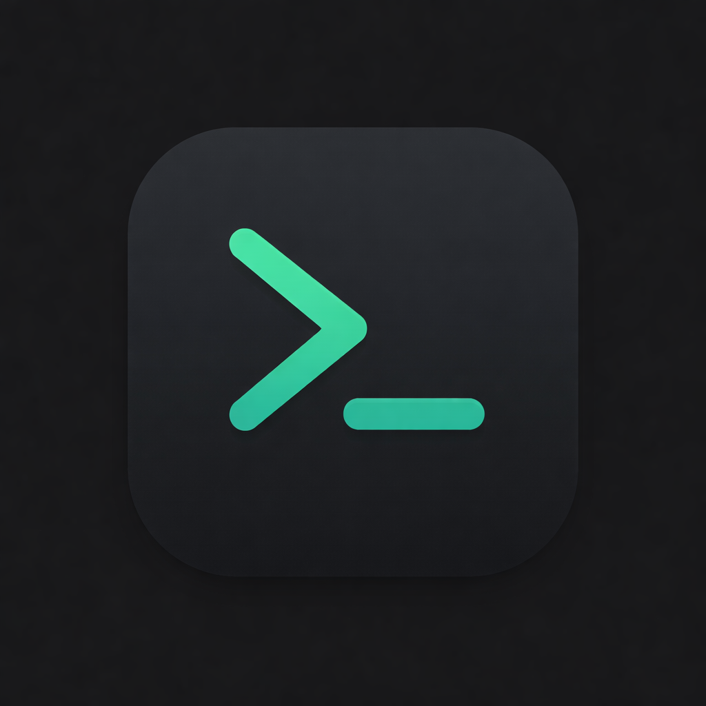
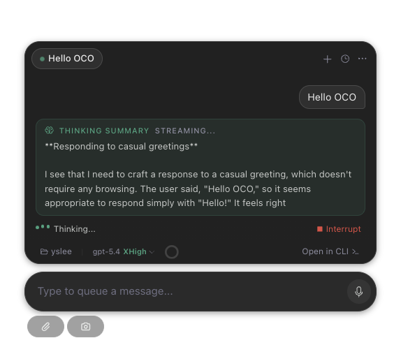
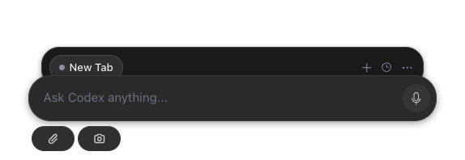
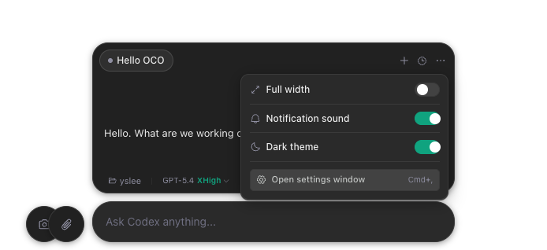
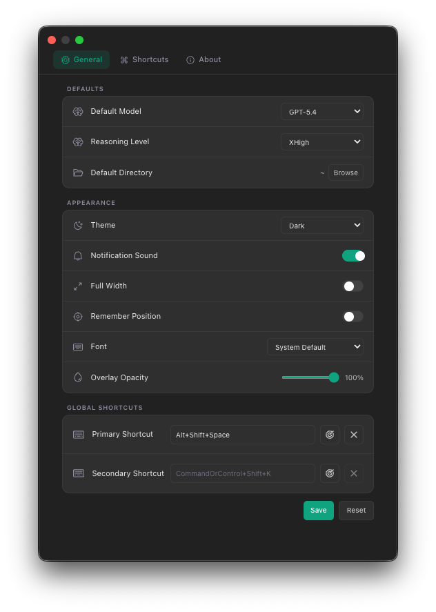
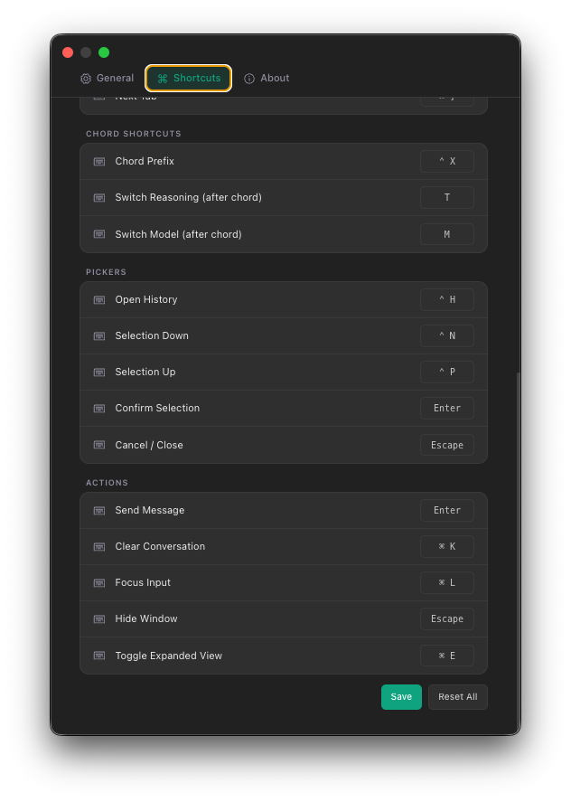

<p align="center">
  
</p>

<h1 align="center">OCO</h1>

<p align="center">
  <strong>OpenAI Codex Overlay</strong> — <a href="https://github.com/openai/codex">OpenAI Codex CLI</a>를 위한 플로팅 데스크톱 오버레이
</p>

<p align="center">
  <a href="#동기">동기</a> ·
  <a href="#설치">설치</a> ·
  <a href="#기능">기능</a> ·
  <a href="#단축키">단축키</a> ·
  <a href="#슬래시-명령어">명령어</a> ·
  <a href="#개발">개발</a> ·
  <a href="README.md">English</a>
</p>

<p align="center">
  
  
  
  
</p>

<br />

<p align="center">
  
</p>

---

## OCO란?

OCO는 OpenAI의 Codex CLI를 모던한 데스크톱 인터페이스로 감싼 **항상 최상위에 떠 있는 클릭 투과 오버레이**입니다. 에디터, 터미널, 어떤 앱 위에서든 떠 있으며 — 창을 전환하지 않고도 AI에 바로 접근할 수 있습니다.

**AI 코딩을 위한 HUD** — 사용하지 않을 때는 투명하게, 필요할 때는 즉시 반응합니다.

## 동기

OCO는 [Clui CC](https://github.com/lcoutodemos/clui-cc)에서 많은 영감을 받았습니다. Clui CC는 `claude -p`를 NDJSON 스트리밍으로 감싼 완성도 높은 Claude Code 오버레이입니다. Clui CC가 탭마다 CLI 프로세스를 개별 생성하는 방식인 반면, OCO는 다른 아키텍처를 택했습니다 — [Codex CLI app-server](https://github.com/openai/codex)에 WebSocket JSON-RPC로 직접 연결하여, 쉘 레벨의 프로세스 관리 없이 Codex 런타임과 네이티브로 통합합니다.

목표는 단순했습니다: 같은 플로팅 오버레이 UX를 Codex 생태계에 가져오되, 처음부터 Codex 네이티브로 구현하는 것.

## 기능

### 핵심

- **투명 오버레이** — 사용하지 않을 때는 클릭이 뒤로 투과되며, UI 요소가 있는 곳에서만 인터랙션
- **멀티탭 대화** — 여러 Codex 세션을 탭으로 병렬 실행
- **세션 지속성** — 과거 대화를 검색하고 이어서 재개
- **실시간 스트리밍** — 토큰 스트리밍과 도구 호출 시각화

<p align="center">
  
  <br />
  <em>접힌 상태 — 화면에 최소한의 공간만 차지</em>
</p>

### 인터페이스

- **글래스모피즘 UI** — 반투명 표면과 배경 블러, 부드러운 애니메이션
- **드래그 이동** — 비대화형 영역을 잡고 드래그하여 위치 변경
- **자동 리사이즈** — 컨텐츠에 맞춰 윈도우 높이가 자동 조절
- **커맨드 팔레트** — 모델, 추론 레벨, 세션 히스토리 빠른 전환
- **다크 & 라이트 테마** — 시스템 설정을 따름

<p align="center">
  
  <br />
  <em>퀵 설정 팝오버 — 테마, 넓이, 알림 등을 인라인으로 토글</em>
</p>

### 연동

- **파일 첨부** — 코드 파일과 이미지를 프롬프트에 직접 첨부
- **스크린샷 캡처** — 영역 선택 스크린샷 → 자동 첨부
- **클립보드 붙여넣기** — 이미지를 입력창에 바로 붙여넣기
- **터미널에서 열기** — 네이티브 터미널 창에서 세션 이어가기
- **스킬 자동완성** — `$`를 입력하면 Codex 스킬 탐색 및 삽입
- **음성 입력** — 로컬 Whisper(WhisperKit 또는 whisper-cpp)를 이용한 푸시투톡 음성 인식

### 커스터마이징

- **글로벌 핫키** — `Alt+Space` 또는 `⌘+Shift+K`로 오버레이 토글 (변경 가능)
- **투명도 조절** — 설정에서 오버레이 투명도 조절
- **폰트 프리셋** — 다양한 폰트 패밀리와 크기 선택
- **단축키 커스터마이징** — 설정 창에서 모든 단축키를 재매핑
- **기본 모델 & 추론 레벨** — 선호하는 모델과 추론 레벨 저장

<p align="center">
  
  <br />
  <em>설정 — 기본값, 외관, 투명도, 글로벌 단축키</em>
</p>

## 설치

### Homebrew (권장)

```bash
brew tap rapidrabbit76/tap
brew install --cask oco
```

### 다운로드

[Releases](https://github.com/rapidrabbit76/OpenAI-Codex-Overlay/releases/latest) 페이지에서 최신 빌드를 받으세요:

| 플랫폼 | 다운로드 |
|---|---|
| macOS (Apple Silicon) | [**OCO-arm64.dmg**](https://github.com/rapidrabbit76/OpenAI-Codex-Overlay/releases/latest/download/OCO-arm64.dmg) |

> **빠른 시작:** DMG 다운로드 → `OCO.app`을 Applications로 드래그 → 실행 → `Alt+Space`으로 토글.

### 사전 요구사항

- **macOS** 12+ (Apple Silicon / Intel)
- **OpenAI Codex CLI** — [설치 가이드](https://github.com/openai/codex#getting-started)

### 소스에서 빌드

```bash
git clone https://github.com/rapidrabbit76/OpenAI-Codex-Overlay.git
cd OpenAI-Codex-Overlay
pnpm install
pnpm dev
```

## 단축키

<p align="center">
  
  <br />
  <em>모든 단축키는 설정 → Shortcuts 탭에서 자유롭게 변경 가능</em>
</p>

### 글로벌

| 단축키 | 동작 |
|---|---|
| `Alt+Space` | 오버레이 토글 |
| `⌘+Shift+K` | 오버레이 토글 (보조) |
| `⌘+,` | 설정 열기 |

### 탭

| 단축키 | 동작 |
|---|---|
| `⌘+T` | 새 탭 |
| `⌘+W` | 탭 닫기 |
| `⌘+[` / `⌘+]` | 이전 / 다음 탭 |
| `⌘+1`–`⌘+9` | N번째 탭으로 이동 |

### 네비게이션

| 단축키 | 동작 |
|---|---|
| `⌘+E` | 확장 뷰 토글 |
| `⌘+K` | 대화 초기화 |
| `⌘+L` | 입력창 포커스 |
| `Escape` | 창 숨기기 |
| `Ctrl+H` | 세션 히스토리 열기 |

### 코드 단축키

`Ctrl+X`를 먼저 누른 후 (코드 프리픽스):

| 키 | 동작 |
|---|---|
| `M` | 모델 전환 |
| `T` | 추론 레벨 전환 |

## 슬래시 명령어

입력창에 `/`를 입력하면 내장 명령어에 접근할 수 있습니다:

| 명령어 | 설명 |
|---|---|
| `/clear` | 대화 기록 초기화 |
| `/new` | 새 대화 탭 시작 |
| `/model` | 현재 모델 표시 또는 전환 |
| `/resume` | 세션 히스토리 피커 열기 |
| `/fork` | 현재 대화를 새 탭으로 분기 |
| `/cost` | 토큰 사용량 및 비용 표시 |
| `/copy` | 최신 어시스턴트 응답 복사 |
| `/status` | 세션 및 앱 상태 표시 |
| `/diff` | Codex에 git diff 요청 |
| `/mention` | 프롬프트에 파일 첨부 |
| `/compact` | Codex에 컨텍스트 압축 요청 |
| `/review` | Codex에 변경 사항 리뷰 요청 |
| `/plan` | Codex를 플랜 모드로 전환 |
| `/init` | Codex에 AGENTS.md 생성 요청 |
| `/fast` | 패스트 프리셋 토글 (gpt-5.4 + low) |
| `/personality` | 커뮤니케이션 스타일 옵션 표시 |
| `/permissions` | 승인 정책 설정 표시 |
| `/mcp` | MCP 서버 설정 힌트 표시 |
| `/exit` | OCO 창 숨기기 |
| `/quit` | OCO 창 숨기기 |
| `/help` | 전체 명령어 표시 |

## 아키텍처

### 동작 방식

1. **메인 프로세스**가 Codex CLI app-server를 자식 프로세스로 실행
2. **WebSocket 전송**이 app-server의 JSON-RPC 인터페이스에 연결
3. **컨트롤 플레인**이 요청 큐를 통해 복수의 탭 세션을 관리
4. **렌더러**가 IPC를 통해 정규화된 이벤트를 수신하고 스트리밍 대화를 렌더링
5. **클릭 투과**는 UI 요소 위의 마우스 위치를 실시간 추적하여 관리

## 설정

설정은 `~/.config/oco/settings.json`에 저장됩니다:

```jsonc
{
  "defaultModel": "gpt-5.4",
  "defaultReasoning": "medium",
  "defaultDirectory": "~",
  "overlayOpacity": 1,
  "rememberPosition": false,
  "fontFamily": "-apple-system, BlinkMacSystemFont, ...",
  "micEnabled": true,
  "voiceLanguage": "",
  "voiceKey": "Alt"
}
```

글로벌 단축키는 `~/Library/Application Support/OCO/shortcut-settings.json`에 별도 저장됩니다.

## 기술 스택

| 레이어 | 기술 |
|---|---|
| 런타임 | [Electron](https://www.electronjs.org/) 35 |
| 빌드 | [electron-vite](https://electron-vite.org/) + [Vite](https://vitejs.dev/) 6 |
| UI | [React](https://react.dev/) 19 + [TypeScript](https://www.typescriptlang.org/) 5 |
| 스타일 | [Tailwind CSS](https://tailwindcss.com/) 4 |
| 상태 관리 | [Zustand](https://github.com/pmndrs/zustand) 5 |
| 애니메이션 | [Framer Motion](https://www.framer.com/motion/) 12 |
| 아이콘 | [Phosphor Icons](https://phosphoricons.com/) |
| 마크다운 | [react-markdown](https://github.com/remarkjs/react-markdown) + [remark-gfm](https://github.com/remarkjs/remark-gfm) |

## 개발

```bash
# 핫 리로드 개발 모드
pnpm dev

# 프로덕션 빌드
pnpm build

# macOS DMG 패키징
pnpm dist:dmg

# Windows EXE 패키징
pnpm dist:win

# 진단 스크립트 실행
pnpm doctor
```

디버그 모드:

```bash
OCO_DEBUG=1 pnpm dev
```

## 문제 해결

- **오버레이가 안 보임** — `Alt+Space`가 다른 앱에 의해 선점되고 있지 않은지 확인
- **"Cannot connect" 에러** — Codex CLI가 설치되어 있고 `codex`가 PATH에 있는지 확인
- **macOS 권한 다이얼로그** — 글로벌 단축키를 위한 접근성 권한을 허용

## 라이선스

[MIT](LICENSE) © rapidrabbit76 (yslee.dev@gmail.com)
